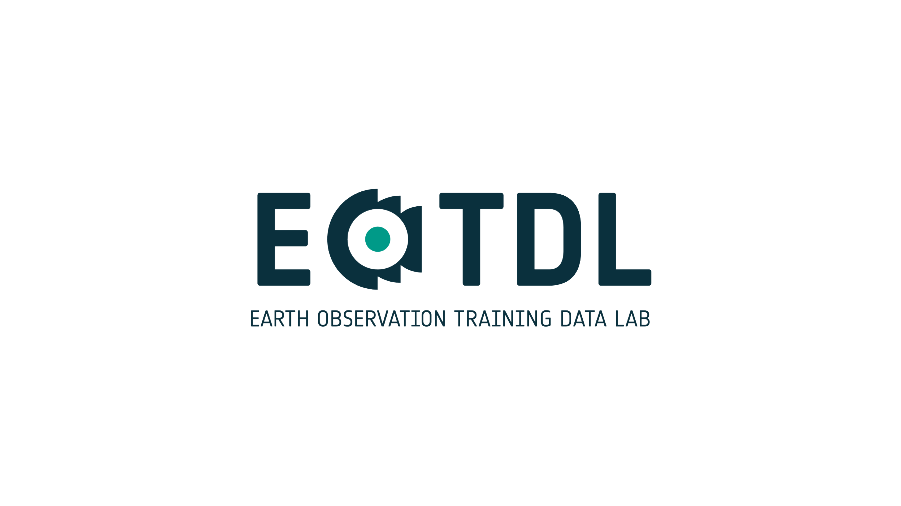

# EOTDL

<p align="center">
  <a href="https://www.eotdl.com/">
    
  </a>
</p>

<p align="center">Explore, download, create and share your own Training Datasets and Machine Learning models for Earth Observation</p>
<p align="center"><a href="https://www.eotdl.com/">Website</a> · <a href="https://www.eotdl.com/docs">Documentation</a> · <a href="https://www.eotdl.com/datasets">Datasets</a> · <a href="https://www.eotdl.com/blog">Blog</a></p>

<p align="center">
    <a href="https://pypi.python.org/pypi/eotdl">
        
    </a>
    <a href="https://discord.eotdl.io">
        
    </a>
</p>

This repository contains de source code of the [**Earth Observation Training Data Lab** (EOTDL)](https://eotdl.com/). It contains a set of Python libraries, APIs, CLIs and User Interfaces to explore, create, manage and share training datasets and Machine Learning models for Earth Observations applications. 

You can learn more at the [EOTDL website](https://eotdl.com/) or start with our [tutorials](./tutorials).

## What's the EOTDL?

The **Earth Observation Training Data Lab** (EOTDL) is a complete environment that allows you, among other things, to:

- Explore and download Training Datasets (TDS) for Earth Observation (EO) applications.
- Create and upload your own TDS by combining and annotating EO data from different sources.
- Train Machine Learning (ML) models using the hosted TDS in the cloud with multi-GPU machines.
- Explore and download pre-trianed ML models for EO applications.

## Why EOTDL?

One of the most limiting factors of AI for EO applications is the scarcity of suitable and accessible Training Datasets (TDS). As the name suggests, TDS are used to train an AI model to perform a specific task. Currently, the main barrier is that gathering and labelling EO data is a convoluted process. Some techniques exist that can help alleviate this issue, for example transfer learning or unsupervised learning, but annotated data is always required for fine-tuning and final validation of AI models.

Generating TDS is time consuming and expensive. Data access is usually limited and costly, especially for Very High Resolution (VHR) images that allow objects like trees to be clearly identified. In some cases, domain experts or even in-person (in-situ) trips are required to manually confirm the objects in a satellite image are correctly annotated with a high degree of quality. This results in the field of AI for EO applications lagging when compared to other fields, impeding the development of new applications and limiting the full potential of AI in EO.

The European Space Agency (ESA) Earth Observation Training Data Lab (EOTDL) will address key limitations and capability gaps for working with Machine Learning (ML) training data in EO by providing a set of open-source tools to create, share, and improve datasets as well as training ML algorithms in the cloud. EOTDL will also offer an online repository where datasets and models can be explored and accessed.

## Installation

_For more details, see the [documentation](https://www.eotdl.com/docs/getting-started/install)_.

You can install the library and CLI using pip.

```
pip install eotdl
```

To verify the installation you can run the help command, which will give you a list of all the available commands in the CLI.

```
eotdl --help
```

Is is recommended to upgrade the package regularly to get the latest changes.

```
pip install eotdl --upgrade
```

> The library and CLI require Python >= 3.8.

## Usage examples and tutorials

In our [blog](https://www.eotdl.com/blog) you will find tutorials to learn how leverage the EOTDL to create and use TDS and ML models for your own EO applications. If you want to put your hands on those tutorials, you can go to the [tutorials](./tutorials/README.md), where you will find a multitude of tutorials, use cases and workshops that have been carried out using EOTDL.

## Contributing

_For more details, see [Contribution page](https://www.eotdl.com/docs/contributing)_.

We love that the community contributes with new and powerful features, and we are glad to take contributions! It is best to get in touch with the maintainers about larger features or design changes before starting the work, as it will make the process of accepting changes smoother.

If you want to contribute, see the [contributing](CONTRIBUTING.md).

## Getting Involved

_For more details, see [Contribution page](https://www.eotdl.com/docs/contributing)_.

To get in touch with the team and other users, join our [Discord](https://discord.gg/hYxc5AJB92). There you will be able to ask questions, share your feedback and get involved in the platform evolution.

## License

The EOTDL is under MIT license. For more details, see the [License](LICENSE.md).